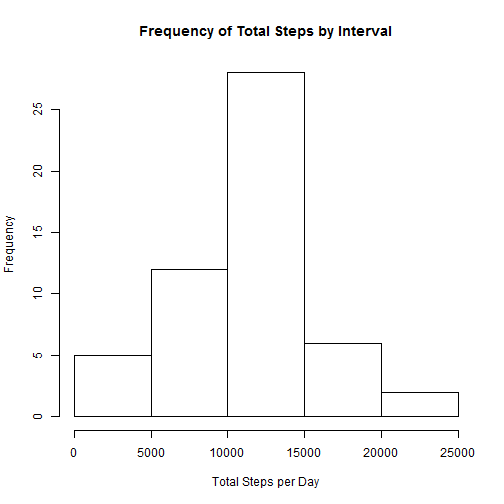
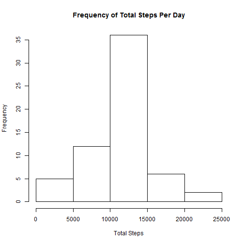
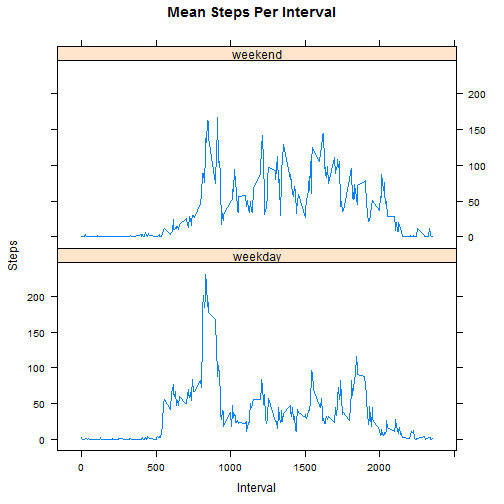

##Introduction

It is now possible to collect a large amount of data about personal movement using activity monitoring devices such as a Fitbit, Nike Fuelband, or Jawbone Up. These type of devices are part of the "quantified self" movement - a group of enthusiasts who take measurements about themselves regularly to improve their health, to find patterns in their behavior, or because they are tech geeks. But these data remain under-utilized both because the raw data are hard to obtain and there is a lack of statistical methods and software for processing and interpreting the data.

This report makes use of data from a personal activity monitoring device. This device collects data at 5 minute intervals through out the day. The data consists of two months of data from an anonymous individual collected during the months of October and November, 2012 and include the number of steps taken in 5 minute intervals each day.

### Initial Set-up

Packages required to run the analysis.

```r
library(lattice)
library(devtools)
```

```
## Warning: package 'devtools' was built under R version 3.2.3
```

```r
devtools::source_gist("4959237")
```

```
## Sourcing https://gist.githubusercontent.com/christophergandrud/4959237/raw/ac2e8ee0a170dd027debee69b6ced8ce9def73f6/FillIn.R
```

```
## SHA-1 hash of file is 27b30a61bb6812f8bed74544070fd586ff656300
```

Load and Pre-Process the data

```r
stepdata <- read.csv("activity.csv")
stepdata$date <- as.Date(stepdata$date)
summary(stepdata)
```

```
##      steps             date               interval     
##  Min.   :  0.00   Min.   :2012-10-01   Min.   :   0.0  
##  1st Qu.:  0.00   1st Qu.:2012-10-16   1st Qu.: 588.8  
##  Median :  0.00   Median :2012-10-31   Median :1177.5  
##  Mean   : 37.38   Mean   :2012-10-31   Mean   :1177.5  
##  3rd Qu.: 12.00   3rd Qu.:2012-11-15   3rd Qu.:1766.2  
##  Max.   :806.00   Max.   :2012-11-30   Max.   :2355.0  
##  NA's   :2304
```
### What is mean total number of steps taken per day?

```r
stepsum <- aggregate(steps ~ date, stepdata, sum, na.rm = TRUE)
hist(stepsum$steps, 
     main = "Frequency of Total Steps by Interval",
     xlab = "Total Steps per Day")
```



The Mean total number of steps per day is:

```r
mean(stepsum$steps, na.rm = TRUE)
```

```
## [1] 10766.19
```
The Median total number of steps per day is:

```r
median(stepsum$steps, na.rm = TRUE)
```

```
## [1] 10765
```

## What is the average daily activity pattern?

```r
stepint <- aggregate(steps ~ interval, stepdata, mean , na.rm = TRUE)
with(stepint, plot(interval, steps, 
                   type = "l"))
```


```r
summary(stepint)
```

```
##     interval          steps        
##  Min.   :   0.0   Min.   :  0.000  
##  1st Qu.: 588.8   1st Qu.:  2.486  
##  Median :1177.5   Median : 34.113  
##  Mean   :1177.5   Mean   : 37.383  
##  3rd Qu.:1766.2   3rd Qu.: 52.835  
##  Max.   :2355.0   Max.   :206.170
```
The results show that the maximum number of steps per interval is 206.17, which occurs at interval 835

```r
stepint[which.max(stepint$steps),]
```

```
##     interval    steps
## 104      835 206.1698
```
## Identifying & Imputing Missing Values

### Determine Missing values
Number of missing data values for steps

```r
sum(is.na(stepdata$steps))
```

```
## [1] 2304
```
Number of missing data values for intervals

```r
sum(is.na(stepdata$interval))
```

```
## [1] 0
```
Number of missing data values for dates

```r
sum(is.na(stepdata$date))
```

```
## [1] 0
```

### Fill in missing data using mean for that interval


```r
newstepdata <- FillIn(D1=stepdata, D2=stepint, Var1 = "steps", Var2 = "steps", KeyVar = "interval")
```

```
## [1] "2304 NAs were replaced."
```

```
## Warning in `[.data.table`(OutDT, is.na(VarGen), `:=`(VarGen, VarGen.1)):
## Coerced 'double' RHS to 'integer' to match the column's type; may have
## truncated precision. Either change the target column to 'double' first (by
## creating a new 'double' vector length 17568 (nrows of entire table) and
## assign that; i.e. 'replace' column), or coerce RHS to 'integer' (e.g. 1L,
## NA_[real|integer]_, as.*, etc) to make your intent clear and for speed. Or,
## set the column type correctly up front when you create the table and stick
## to it, please.
```

```
## [1] "The correlation between steps and steps is 0.366 based on 17568 shared observations."
```
### Histogram of total steps 
In order to examine the total steps per day, a new dataset of the sums of the steps by day was created for graphing purposes. 

```r
newstepsum <- aggregate(steps ~ date, newstepdata, sum, na.rm = TRUE)

par(mar=c(5.1,4.1,4.1,2.1),mfrow = c(1,1) )
hist(newstepsum$steps, 
     main = "Frequency of Total Steps Per Day", 
     xlab = "Total Steps")
```


The Mean total number of steps is:

```r
mean(newstepsum$steps, na.rm = TRUE)
```

```
## [1] 10749.77
```
The Median total number of steps is:

```r
median(newstepsum$steps, na.rm = TRUE)
```

```
## [1] 10641
```

## Are there differences in activity patterns between weekdays and weekends?

In order to evaluate the whether there is a difference between the number of steps taken on a weekend, and on a weekday, by interval, a field indicating the day type was added to the data frame.


```r
newstepdata$day <- weekdays(newstepdata$date, abbreviate = TRUE)
newstepdata$isweekend <- grepl("S(at|un)", newstepdata$day)
newstepdata$isweekend <- gsub("TRUE", "weekend", newstepdata$isweekend, perl=TRUE)
newstepdata$isweekend <- gsub("FALSE", "weekday", newstepdata$isweekend, perl=TRUE)

## weekend & weekday subsets

weekendsub <- subset(newstepdata, grepl("S(at|un)", day), interval:day)
westepint <- aggregate(steps ~ interval, 
                       weekendsub, mean , na.rm = TRUE)
westepint$isweekend <- "weekend"
weekdaysub <- subset(newstepdata, !grepl("S(at|un)", day), interval:day)
wdstepint <- aggregate(steps ~ interval, 
                       weekdaysub, mean , na.rm = TRUE)
wdstepint$isweekend <- "weekday"

## remerge data to average subset

mergeddata <- rbind(westepint,wdstepint)
```

Once the data was ready, a line plot was created to examine the difference between the day types.  As the graph shows, the number of steps during the week was substantially lower during the middle of the day than it was during the weekends.


```r
xyplot(steps~interval|isweekend, 
       data=mergeddata,
       layout=c(1,2), 
       type ='l', 
       main= "Mean Steps Per Interval", 
       xlab= "Interval", 
       ylab="Steps")
```


